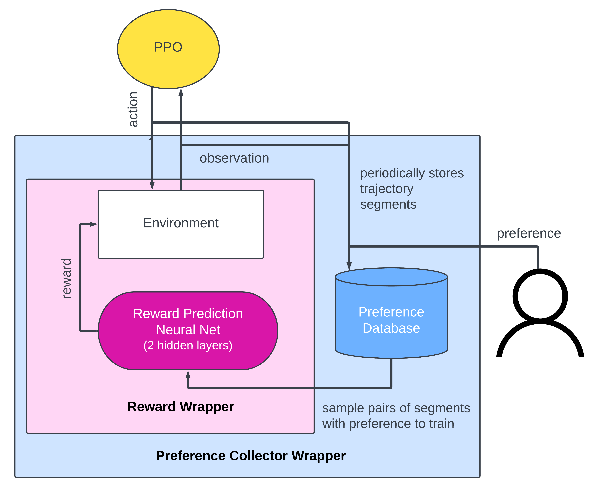

# Replicating Deep Reinforcement Learning From Human Preferences in Robotic Tasks

This is an attempt to implement a minimal (in the fashion of Karpathy's minGPT) version of the architecture described in the paper [Deep Reinforcement Learning from Human Preferences](https://arxiv.org/abs/1706.03741) in [Gym](https://github.com/openai/gym). 

The learnable reward network and the preference collector are implemented as wrappers of the Gym environment. This way, the RLHF structure is completely independent from specific policy used (PPO here).

Like the original paper, this implementation includes a pipeline to generate and train on **synthetic feedback**. 

## Using this code

#### Providing feedback yourself via the keyboard

1 or 2 for prefering left or right clip | Space for equal | Delete/Backspace for incomparable

`python src/main.py --env-name pendulum --num-batches 50`

#### Using an oracle for synthetic feedback: 

`python src/main.py --env-name pendulum --synthetic --num-batches 50`

## Simplifications

1. Train one reward predictor instead of an ensemble.
2. As a result of 1, cannot follow the original paper in prioritizing asking about segments for which there is the most disagreement among the ensemble members. The original ablation study using no ensemble picks queries uniformly at random. I further simplify this to asking for preference at a constant rate defined in the number of steps. This is also a simplification of the decaying query schedule in the paper.
3. Omit $\ell_2$ regularization or dropout on the reward predictors, which is used in the original paper to keep the validation loss between $1.1$ and $1.5$ times the training loss.

## Getting a drastically simplified RLHF model to work

(For a more detailed discussion on how different hyperparameters/simplifications affect performance, see Section 4 of the [project report](./project_report.pdf).)

### Entropy bonus

Originally, I simplified entropy bonus away along with the other simplifications mentioned above. Unfortunately that caused the model to suffer from severe under-exploration and not train at all. Entropy bonus turns out to be an essential measure against a changing reward function even for a simplified model on a simple task. 

In fact, a simplified model might particularly need aggressive exploration to make up for lost performance and stability due to the omitted designs. The original paper found the optimal entropy bonus to be $0.01$, but I found that the larger the entropy bonus (up to $0.1$) the better. 

### Reward network overfitting

In earlier implementations, I found that while the reward network achieves low training loss quickly (correct relative magnitude of the _sums_ of the rewards across _all steps_ in the trajectories), the Spearman correlation between the predicted reward and the ground truth reward peaks and then continually decreases, suggesting overfitting. Updating the reward network less frequently significantly improves the problem.

(Of course in real-life applications, there are no ground truth rewards, but when feeding more preference data into the reward network does not help with the policy performance plateauing, one might consider the hyperparameter of reward network update frequency.)

### Clip length

For a task like inverted pendulum with a single, static goal state (pendulum pointing up), using shorter clip lengths later in the training significantly improves the quality of predicted rewards, because as the policy improves and keep the agent in close-to-optimal states, its movements become so small that a clip is going to contain many independent attempts, making the preference signal very noisy. 
